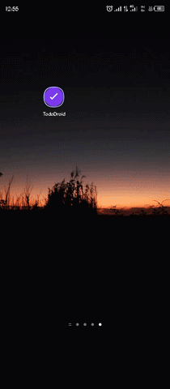

# 📱 TodoDroid — Built on a Phone, For Productivity

**A full-featured Android task manager and rich note editor — built and compiled entirely on an Android phone using Termux. No PC. No Android Studio.**

## ✨ Features
Tasks with category grouping | Rich text notes | Speech-to-text | Camera backgrounds | 8 color themes | Real-time search | Sort & view options | Cloud backup | Home screen widget | Dark mode | Local storage

## 📦 Download
Get the latest APK from [Releases](https://github.com/BLESS06703/TodoDroid/releases/latest)

## 👤 Built by BLESS SCOTT — Lilongwe, Malawi
[GitHub](https://github.com/BLESS06703) | [Instagram](https://instagram.com/bless.kaundah0)

## 🎥 Demo

